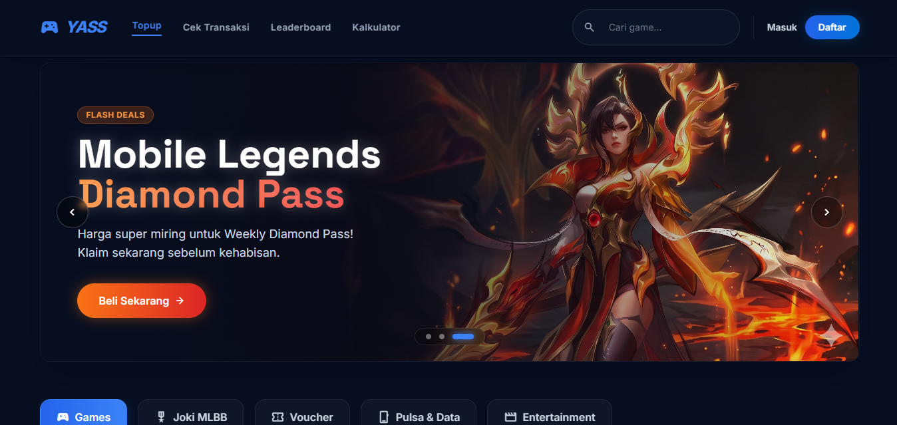
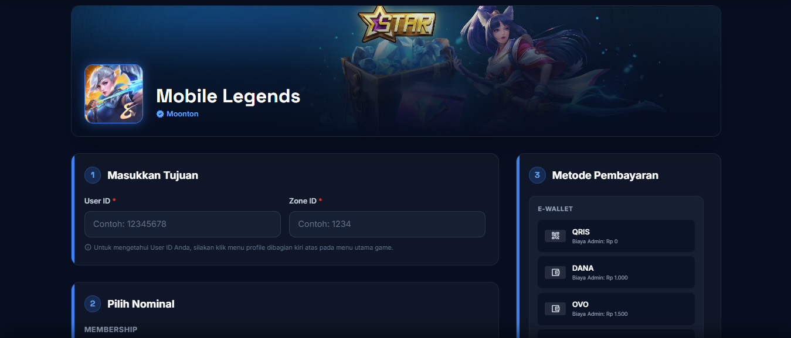
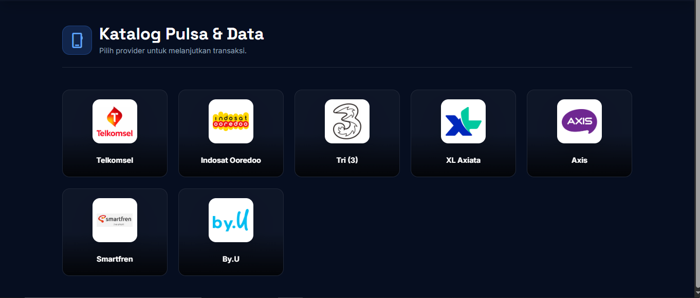
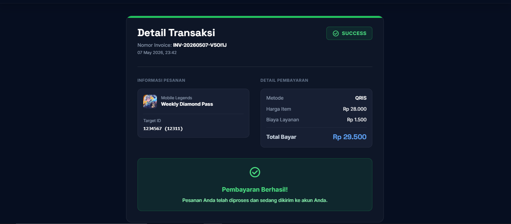
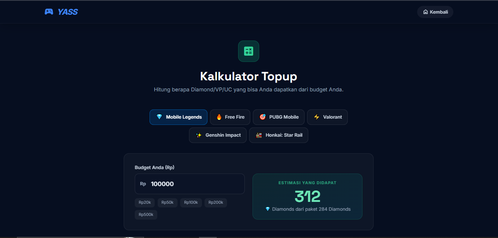
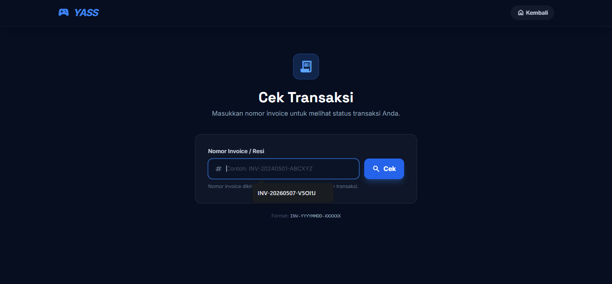

<div align="center">

# 🎮 YASS Game Store

**Platform Top-Up Game & Entertainment Premium Indonesia**

[](https://laravel.com)
[](https://php.net)
[](https://tailwindcss.com)
[](https://mysql.com)
[](LICENSE)

*Termurah · Tercepat · Terpercaya · 24/7 Otomatis*

---

> ⚠️ **Catatan:** Project ini dibuat untuk keperluan **portofolio** dan **demonstrasi teknis**. Integrasi payment gateway (Tripay) dan provider pulsa (Digiflazz) berjalan dalam mode simulasi.

</div>

---

## 📸 Screenshots


| Halaman Utama | Halaman Order |
|:---:|:---:|
|  |  |

| Katalog Pulsa & Data | Halaman Invoice |
|:---:|:---:|
|  |  |

| Kalkulator Topup | Cek Transaksi |
|:---:|:---:|
|  |  |

---

## ✨ Fitur Utama

### 🛒 Sistem Topup Game
- **6 Game Populer** — Mobile Legends, Free Fire, PUBG Mobile, Valorant, Genshin Impact, Honkai: Star Rail
- **Halaman Order Dinamis** — Template order yang digunakan ulang untuk semua game, dilengkapi validasi Game ID
- **Auto Nickname Checker** — Verifikasi nama akun sebelum pembelian tanpa perlu membuka game
- **Checkout Flow Lengkap** — Dari pilih produk → isi data → konfirmasi → invoice → simulasi pembayaran

### 📱 Katalog Layanan Digital
- **Pulsa & Data** — Telkomsel, Indosat Ooredoo, Tri (3), XL Axiata, Axis, Smartfren, By.U
- **Voucher Game** — Google Play, Steam Wallet, Garena Shells, PlayStation Network, Spotify, Netflix
- **Entertainment** — Netflix, Spotify, YouTube Premium, Disney+ Hotstar, Vidio, WeTV, Apple TV+

### 🎯 Fitur Khusus
- **Joki MLBB** — Layanan boost rank Mobile Legends dengan kalkulator harga dinamis berbasis selisih bintang
- **Kalkulator Topup** — Estimasi budget untuk 6 game sekaligus dengan preset nominal cepat
- **Cek Transaksi** — Lookup status transaksi real-time menggunakan nomor invoice
- **Invoice Otomatis** — Halaman invoice dengan auto-refresh status & tombol simulasi pembayaran lunas

### 🔧 Teknis & Infrastruktur
- **Webhook Handler** — Endpoint `/webhook` untuk menerima callback dari Tripay dengan validasi signature HMAC-SHA256
- **Service Layer** — `TransactionService` & `PaymentService` untuk memisahkan logika bisnis dari controller
- **Database Seeder** — Data kategori dan produk siap pakai untuk environment development
- **Feature Tests** — Suite pengujian TDD menggunakan SQLite in-memory untuk alur transaksi & checkout

---

## 🛠️ Tech Stack

| Layer | Teknologi |
|---|---|
| **Backend Framework** | Laravel 10 (PHP 8.1+) |
| **Frontend Styling** | Tailwind CSS (via CDN) + Custom Glassmorphism |
| **Database** | MySQL 8.0 (`db_web-topup`) |
| **Font & Icons** | Google Fonts (Inter, Space Grotesk) + Material Symbols |
| **Payment Gateway** | Tripay (mode simulasi) |
| **Provider Pulsa** | Digiflazz (mode simulasi) |
| **Testing** | PHPUnit + SQLite In-Memory |
| **Web Server** | Apache (XAMPP) |

---

## 📁 Struktur Project

```
web-topup/
├── app/
│   ├── Http/Controllers/
│   │   ├── OrderController.php        # Halaman order per game
│   │   ├── TransactionController.php  # Checkout, invoice, simulasi
│   │   └── WebhookController.php      # Callback payment gateway
│   └── Services/
│       ├── TransactionService.php     # Logika pembuatan transaksi
│       ├── PaymentService.php         # Integrasi Tripay
│       └── ProviderService.php        # Integrasi Digiflazz
│
├── database/
│   ├── migrations/                    # Skema tabel
│   └── seeders/
│       └── DatabaseSeeder.php         # Data kategori & produk awal
│
├── resources/views/
│   ├── home.blade.php                 # Halaman utama (hero, katalog, promo)
│   ├── order.blade.php                # Template order dinamis semua game
│   ├── joki.blade.php                 # Halaman joki MLBB + kalkulator
│   ├── invoice.blade.php              # Halaman invoice & status pembayaran
│   ├── katalog.blade.php              # Katalog Pulsa, Voucher, Entertainment
│   ├── games.blade.php                # Daftar semua game (dengan search)
│   ├── kalkulator.blade.php           # Kalkulator budget topup
│   ├── cek-transaksi.blade.php        # Form cek status transaksi
│   └── coming-soon.blade.php          # Placeholder fitur dalam pengembangan
│
├── routes/
│   └── web.php                        # Semua routing aplikasi
│
└── public/
    └── assets/images/
        ├── games/icons/               # Ikon game & provider
        └── banners/                   # Banner slider & promo
```

---

## 🚀 Cara Instalasi (Development)

### Prasyarat
- PHP `>= 8.1` dengan ekstensi `pdo_mysql`, `mbstring`, `openssl`
- [Composer](https://getcomposer.org/)
- [XAMPP](https://www.apachefriends.org/) atau MySQL server
- Node.js (opsional, untuk tooling)

### Langkah-langkah

**1. Clone repository**
```bash
git clone https://github.com/username/web-topup.git
cd web-topup
```

**2. Install dependencies**
```bash
composer install
```

**3. Setup environment**
```bash
cp .env.example .env
php artisan key:generate
```

**4. Konfigurasi database di `.env`**
```env
DB_CONNECTION=mysql
DB_HOST=127.0.0.1
DB_PORT=3306
DB_DATABASE=db_web-topup
DB_USERNAME=root
DB_PASSWORD=
```

**5. Jalankan migrasi & seeder**
```bash
php artisan migrate
php artisan db:seed
```

**6. Jalankan server**
```bash
php artisan serve
# Atau akses via XAMPP: http://localhost/web-topup/public
```

---

## 🗺️ Daftar Rute

| Method | Route | Deskripsi |
|---|---|---|
| `GET` | `/` | Halaman utama |
| `GET` | `/order/{game}` | Halaman order per game |
| `GET` | `/joki/mlbb` | Layanan Joki Mobile Legends |
| `GET` | `/games` | Semua game (dengan pencarian) |
| `GET` | `/katalog/{type}` | Katalog: `pulsa`, `voucher`, `entertainment` |
| `POST` | `/checkout` | Proses checkout & buat transaksi |
| `GET` | `/invoice/{reference}` | Halaman invoice transaksi |
| `POST` | `/api/simulate-payment/{ref}` | Simulasi pembayaran lunas |
| `GET` | `/cek-transaksi` | Form cek status transaksi |
| `GET` | `/kalkulator` | Kalkulator budget topup |
| `GET` | `/leaderboard` | Leaderboard *(coming soon)* |
| `GET` | `/prestige` | YASS Prestige VIP *(coming soon)* |
| `GET` | `/login` | Masuk akun *(coming soon)* |
| `GET` | `/register` | Daftar akun *(coming soon)* |
| `POST` | `/webhook` | Callback dari Tripay |

---

## 🧪 Menjalankan Test

```bash
php artisan test
```

Test suite mencakup:
- ✅ Alur checkout (membuat transaksi baru)
- ✅ Validasi data checkout (field wajib)
- ✅ Simulasi webhook pembayaran lunas
- ✅ Pencegahan double-processing webhook

---

## 🔮 Fitur yang Direncanakan

- [ ] 🔐 **Autentikasi Pengguna** — Login, Register, dashboard riwayat transaksi
- [ ] 🏆 **Leaderboard** — Top Spender & Top Buyer
- [ ] 👑 **YASS Prestige** — Program VIP Member dengan harga reseller
- [ ] 🛡️ **Dashboard Admin** — Manajemen transaksi & monitoring pesanan
- [ ] 📡 **Integrasi API Nyata** — Sambungkan ke Tripay & Digiflazz production

---

## 👨‍💻 Developer

<div align="center">

**Ilyas Arifin Putra**

[](https://instagram.com/ilyasarifinputraa)
[](https://wa.me/6289665433636)

</div>

---

<div align="center">

Made with ❤️ in Indonesia

*© 2024 YASS Game Store. All Rights Reserved.*

</div>
